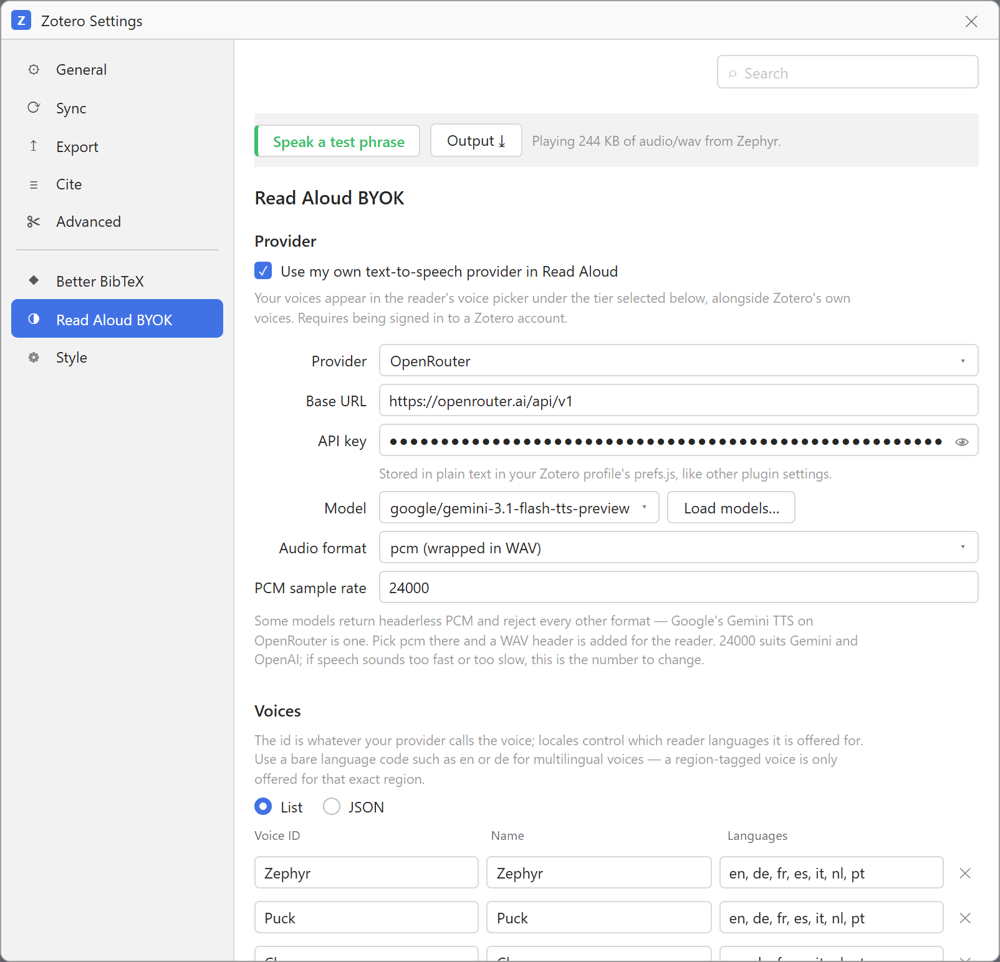
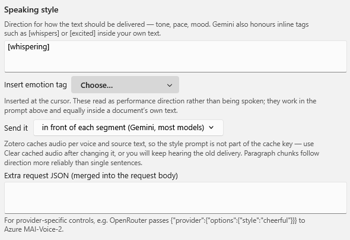
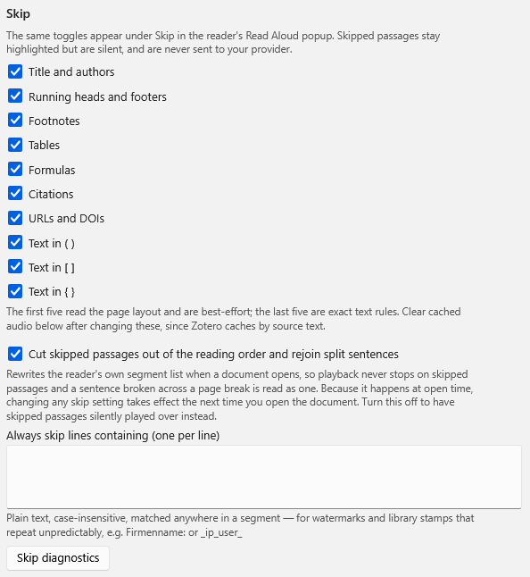

# Read Aloud BYOK

Bring your own text-to-speech key to Zotero 9's built-in Read Aloud, instead of spending Zotero's
metered Standard/Premium minutes or falling back to the local SAPI voices.

Works with OpenAI-compatible endpoints (including OpenRouter and self-hosted servers), ElevenLabs,
Speechify, Azure Speech, Google Gemini TTS, or any custom endpoint. Adds a **Skip** panel to the
reader for leaving out titles, running heads, footnotes, tables, formulas, citations, URLs and
bracketed asides — and stitches sentences broken across a page break back together.

Requires Zotero 9. MIT licensed.



## How it works

Zotero's reader gets its voice catalog and its audio from the parent process through two methods on
`Zotero.Sync.APIClient.prototype`:

| Method | Called for |
| --- | --- |
| `getReadAloudVoices()` | Populating the voice picker (`GET /tts/voices`) |
| `getReadAloudAudio(segment, voiceID)` | Every sentence or paragraph (`POST /tts/speak`) |

This plugin wraps both. Voices you configure are merged into the catalog under a namespaced
`byok:` ID, and any audio request for one of those IDs is answered by your provider rather than
`api.zotero.org`. Everything else stays stock Zotero: sentence segmentation, the three-segment
prefetch, the parent-process audio cache, playback speed, sentence highlighting, annotation from
the reading position, and resume-where-you-left-off.

Because `creditsPerMinute` is reported as `0`, the reader shows no quota bar and never offers to
sell you more minutes for these voices.

## Install

Download `read-aloud-byok.xpi` from
[Releases](https://github.com/GeneralPawz/zotero-tts-byok/releases), or build it from a checkout:

```powershell
.\build.ps1
```

Then in Zotero: Tools → Plugins → gear icon → **Install Plugin From File…** → pick the `.xpi`,
and open Edit → Settings → **Read Aloud BYOK**. The **About** section at the foot of the pane
shows which build is actually running.

If a PDF tab is already open, close and reopen it — the voice list is fetched when the reader
initialises.

## Updates

Zotero updates the plugin itself. It polls the `update_url` in the manifest — `update.json` in
this repository — and offers whatever version that file advertises, so a new GitHub release
reaches existing installs without anyone downloading an `.xpi`. Tools → Plugins → gear icon →
**Check for Updates** forces a check.

Two details Zotero's `AddonUpdateChecker` insists on: the compatibility entry must be under
`applications.zotero` — an update advertised under Firefox's `gecko` key is silently skipped —
and `update_url` must be `https:`, or the add-on is marked broken rather than merely not updated.

`update.json` also carries a `sha256` of the release asset, so a truncated or tampered download
is rejected instead of installed.

### Cutting a release

Bump `version` in `src/manifest.json`, then:

```
git tag v1.7.0 && git push origin v1.7.0
```

`.github/workflows/release.yml` takes it from there: it refuses the tag if it disagrees with the
manifest, runs the four test suites, builds, publishes the release with the `.xpi` attached,
regenerates `update.json` with the new version, link and hash, and commits it to `main` — which
is the moment existing installs start seeing the update.

To do it by hand, `.\build.ps1` then
`node scripts/make-update-manifest.mjs v1.7.0` produces the same `update.json`.

## Requirements

You must be signed in to a Zotero account. The reader only asks for remote voices at all when
`Zotero.Sync.Runner.enabled` is true, and that check happens before this plugin is consulted. No
Zotero credits are consumed by your own voices.

## Provider setup

### OpenAI-compatible

Works with OpenAI, Groq, DeepInfra, Lemonfox, and self-hosted servers that implement
`POST /v1/audio/speech` — Kokoro-FastAPI, Speaches, openedai-speech, LM Studio.

| Field | Example |
| --- | --- |
| Base URL | `https://api.openai.com/v1` or `http://127.0.0.1:8880/v1` |
| Model | `gpt-4o-mini-tts`, `tts-1`, `kokoro` |
| Audio format | `mp3` |

For local servers, **Load from provider…** reads `GET /audio/voices`. `api.openai.com` has no such
endpoint, so its voices are pre-filled instead.

### OpenRouter

Its own entry in the provider list, though it speaks the OpenAI dialect — one key across every
TTS provider it routes to.

| Field | Value |
| --- | --- |
| Provider | OpenRouter |
| Base URL | `https://openrouter.ai/api/v1` |
| Model | a speech slug, e.g. `google/gemini-3.1-flash-tts-preview` |
| Audio format | `mp3`, or `pcm` for models that refuse everything else |

OpenRouter reports *that* a model accepts `response_format` but not which values, so a mismatch
only shows up as `HTTP 400`. Gemini TTS in particular accepts **`pcm` only** — select that and the
plugin adds a WAV header at the configured sample rate (24000 for Gemini and OpenAI).

OpenRouter's speech models are **not** in its default `/models` listing, and there is no OpenAI TTS
model on it at all — `openai/gpt-4o-mini-tts` and the voices `alloy`/`nova` do not exist there.
**Load from provider…** queries `/models?output_modalities=speech`, matches your configured model,
and fills in its `supported_voices`; if the slug is wrong it lists every valid one.

Some slugs, cheapest first: `google/gemini-3.1-flash-tts-preview` (30 multilingual voices),
`hexgrad/kokoro-82m` (54 voices, no German), `microsoft/mai-voice-2-flash`,
`mistralai/voxtral-mini-tts-2603`, `deepgram/aura-2` (90 voices incl. 7 German), `x-ai/grok-voice-tts-1.0`.

### ElevenLabs

| Field | Example |
| --- | --- |
| Base URL | `https://api.elevenlabs.io/v1` |
| Model | `eleven_turbo_v2_5` (fast/cheap) or `eleven_multilingual_v2` (best quality) |

**Load from provider…** pulls your voice library, including cloned voices. Voice IDs are the
ElevenLabs `voice_id` values.

### Speechify

| Field | Example |
| --- | --- |
| Base URL | `https://api.speechify.ai/v1` |
| API key | from `platform.speechify.ai/api-keys`, sent as `Authorization: Bearer` |
| Model | `simba-3.0` (default), `simba-3.2`, `simba-english`, `simba-multilingual` |

Uses `POST /audio/speech`, which returns base64 audio in `audio_data`; the plugin requests mp3 and
decodes it. The voice's locale is passed as `language` so multilingual models pick the right accent.

**Load from provider…** reads `GET /voices`, following `next_cursor` pagination, and derives each
voice's languages from the locales its models declare.

### Azure Speech

| Field | Example |
| --- | --- |
| Region or endpoint URL | `westeurope`, or a full custom endpoint URL |
| API key | Your Speech resource key |
| Voice IDs | `de-DE-KatjaNeural`, `en-US-AvaNeural` |

Requests are sent as SSML; the voice ID is the Azure short name. Enter voices manually.

### Google Gemini TTS

| Field | Example |
| --- | --- |
| Base URL | `https://generativelanguage.googleapis.com/v1beta` |
| Model | `gemini-2.5-flash-preview-tts` |
| Voice IDs | `Kore`, `Puck`, `Charon`, `Zephyr` |

Gemini returns headerless 24 kHz mono PCM, which the plugin wraps in a WAV container before
handing it to the reader.

### Custom endpoint

For anything else. Placeholders `{{text}}`, `{{voice}}`, `{{model}}`, `{{lang}}` and `{{key}}` are
substituted into the URL, headers and body. Values going into the JSON body are string-escaped, so
quotes and newlines in the source text can't break the request.

If the endpoint returns raw audio bytes, leave **Audio path** empty. If it returns base64 inside
JSON, give the dotted path to it, plus a MIME type — or a **Raw PCM sample rate** if the payload
has no container.

## Voice list format

The Voices section has two views. **List** is a plain editor — one row per voice, with an add and
a remove button — and is the one to use if JSON is not your thing. **JSON** is the same data raw,
with syntax highlighting, for pasting a whole set at once. Both write the same setting, so you can
switch between them freely.

```json
[
  { "id": "nova", "label": "Nova", "locales": ["en", "de"] },
  { "id": "de-DE-KatjaNeural", "label": "Katja", "locales": ["de-DE"] }
]
```

`locales` decides which reader languages offer the voice. The reader picks a language from the
document, so a voice needs a matching locale listed to show up.

Use a **bare language code** (`en`, `de`) for multilingual voices: the reader offers a
region-tagged voice only for documents in that exact region, but an untagged one for every region,
so `en-US` would hide the voice from an `en-GB` document. Tag the region only when the voice really
is region-specific, as Azure's neural voices are.

## Speaking style



Expressive models take direction in natural language. Gemini's convention is to put it in the text
itself — `Say cheerfully: Have a wonderful day!` — and it also honours inline tags like
`[whispers]`, `[shouting]`, `[excited]` and `[sigh]`. OpenAI's expressive models instead read an
`instructions` field. The **Send it** dropdown picks which of the two the plugin uses.

In prepend mode the prompt is glued to the front of every segment, joined by a space if it ends in
a colon or dash and by a blank line otherwise, so both of these work:

```
Say the following calmly and clearly, at a measured pace:
```
```
You are reading an academic paper aloud to a colleague. Keep the tone even and unhurried.
```

Two things to know. Zotero's audio cache is keyed on the voice and the *source* text, not the style
prompt, so **Clear cached audio** after changing it or you'll keep hearing the previous delivery.
And direction lands more reliably on paragraphs than on single sentences — if a model starts
reading the instruction aloud, switch the chunk size to paragraphs.

**Extra request JSON** is merged over the request body for provider-specific controls, such as
`{"provider":{"options":{"style":"cheerful","styledegree":1.5}}}` for Azure MAI-Voice-2 via
OpenRouter.

### Inline emotion tags

Gemini reads bracketed tags as performance direction rather than speaking them. They work in the
style prompt and equally inside a document's own text. The **Insert emotion tag** picker under the
prompt offers the tested set, grouped as below, and drops the choice in at the cursor.

These have been tested and work; they are ordinary English words, so spelling matters more than
the brackets do.

| Register | Tags |
| --- | --- |
| Amusement | `[laughing]`, `[silly]`, `[hysterical]` |
| Joy | `[joyful]`, `[delighted]`, `[thrilled]`, `[ecstatic]` |
| Yearning | `[longing]`, `[lust]` |
| Surprise | `[surprised]`, `[startled]`, `[flabbergasted]` |
| Displeasure | `[annoyed]`, `[bitter]`, `[angry]`, `[hostile]`, `[disgusted]` |
| Delivery | `[whispering]` |

There is a document for trying them. `test/fixtures/speaking-test.txt` is a short scene that uses
every tag above at least once, and

```
node scripts/make-speaking-test.mjs
```

turns it into `target/speaking-test.pdf`. Add that to Zotero and read it aloud to hear how a voice
handles the whole set in context, rather than one tag at a time in the prompt box.

Tags apply from where they appear until the mood shifts, so they can be mixed inside one passage:

```
[whispering] The manuscript had been missing for eighty years. [thrilled] And there it was.
```

They combine with the style prompt — the prompt sets the baseline register for everything, the
tags move it locally. Since Zotero caches audio by voice and source text, tags placed in a
document's own text are cached like any other reading; a changed **style prompt** is not, so clear
the cached audio after editing it.

## Skip



A **Skip** row is added to the reader's Read Aloud popup; clicking it reveals toggles for what to
leave out. The same toggles are mirrored in this plugin's preferences pane.

Skipped passages are never sent to the provider, so they cost nothing. How they are removed depends
on one setting:

- **Cut skipped passages out of the reading order** (default): when a document opens, the reader's
  own segment list is measured, pruned, and sentences split across a page break are stitched back
  together. Playback then never reaches the skipped passages at all — no pause at page boundaries,
  and a broken sentence is spoken as one. Because this happens at open time, changing a skip
  setting takes effect the next time the document is opened.
- With it off, skipped segments stay in the list and are answered locally with a beat of silence.
  Changes take effect immediately, but playback visibly steps over each skipped passage.

Anything the rewrite misses still falls back to the silence path, so the two work together.

Two kinds of rule:

**Exact text rules** rewrite the sentence before it is spoken.

| Rule | Removes |
| --- | --- |
| Text in ( ) [ ] { } | Balanced pairs including nested ones, so `(see Fig. 2 (right))` goes entirely |
| Citations | `[12]`, `[3, 4]`, `(Smith et al., 2020)`, `(Doe & Roe 1999; Lee 2001)`, trailing markers |
| URLs and DOIs | `http(s)://…`, `www.…`, `doi:…`, bare `10.xxxx/…`, e-mail addresses |

**Layout rules** drop a whole segment, and are best-effort. Zotero gives each segment a page index
and its rectangles, so rect height stands in for font size:

| Rule | How it decides |
| --- | --- |
| Title and authors | Page one up to the first run of 100+ characters, capped at 20 segments |
| Running heads and footers | Lines up to 200 chars whose text, with digits normalised, repeats on 2+ pages |
| Footnotes | Type noticeably smaller than the document's median |
| Formulas | Dense in operators, and too few real words to be a sentence |
| Tables | Mostly numeric cells, or rectangles separated by wide column gaps |

The layout rules need the document measured first, which reads the reader's internal segment list.
Measuring happens when the reader panel opens and, failing that, before the first segment is
spoken. If it fails the rules simply stay inactive — press **Skip diagnostics** in the preferences
pane to see whether a document was measured and exactly which repeated lines were found.

Citation stripping is heuristic where trailing superscript markers are concerned: `…as shown.12`
loses the marker, but so would `sample1` if it appeared in running text.

**Always skip lines containing** is the escape hatch for anything the heuristics miss — library
watermarks and print stamps in particular, whose text extraction can differ from page to page so
that the repeated-line rule never sees two identical copies. One plain, case-insensitive string per
line, matched anywhere in a segment.

## Diagnostic log

**Write a diagnostic log (JSONL)** in the preferences pane appends one JSON object per line to
`byok-tts.jsonl` in the Zotero profile. Off by default. It records:

| Event | Contents |
| --- | --- |
| `session` | plugin build, Zotero version, every effective setting |
| `prepare` | whether the reading order could be rewritten, and the segment counts |
| `analyze` | measured body height, margin band, front-matter boundary, repeated lines found |
| `rewrite` | how many segments were dropped and stitched, and whether it took effect |
| `segment` | every skip/speak decision with the rule, page, height, position and text |
| `request` | provider, model, voice, characters sent, duration, bytes or error |

The API key is never written — only `apiKeySet: true/false`. **Show log file** reveals it, **Show
last entries** prints the tail into the copyable status box, **Clear log** starts fresh.

The pane header shows the running plugin and Zotero versions, so it is always possible to confirm
which build is actually loaded.

## Getting it listed

Zotero has no plugin directory yet. Its own
[plugins page](https://www.zotero.org/support/plugins) says so outright — "We don't currently
provide a list of available plugins" — and points at the forums, with an official directory
"planned". So there is nothing to submit to there, and no wiki entry to add.

What exists in the meantime:

| Where | What it is |
| --- | --- |
| [Zotero Forums](https://forums.zotero.org/) | Where plugins are actually announced and found |
| [syt2/zotero-addons-scraper](https://github.com/syt2/zotero-addons-scraper) | Feeds the Zotero Addons in-app browser; takes submissions |
| [zotero-plugin-dev/zotero-plugin-registry](https://github.com/zotero-plugin-dev/zotero-plugin-registry) | Work in progress; aggregates self-hosted `update.json` files |

Both registries read the same `update.json` this repository already publishes, so the plugin is
ready to be listed as soon as an entry is submitted. They are expected to fold into the official
directory when it arrives.

## Project layout

```
src/            everything that ships inside the .xpi
  manifest.json, bootstrap.js, prefs.js, icon.png
  lib/          byok-tts.js, skip.js, log.js, readerUI.js
  prefs/        pane.xhtml, pane.js, pane.css
  locale/       en-US, de — picked up automatically by Zotero
test/           node checks, not packaged
  fixtures/     speaking-test.txt, the emotion tag scene
scripts/        make-update-manifest.mjs, make-speaking-test.mjs
.github/        CI on every push, release on every v* tag
images/         README screenshots
target/         build output, gitignored
```

`build.ps1` stages `src/` and writes `target/read-aloud-byok.xpi`. It adds ZIP entries one at a
time rather than using `CreateFromDirectory`, which on Windows writes subdirectory entries with a
backslash — not a valid ZIP path separator, and Zotero rejects such a package with a generic "may
be incompatible" message. The script fails the build if a backslash or a missing root
`manifest.json` slips through.

## Localisation

Strings live in `src/locale/<locale>/read-aloud-byok.ftl`. Zotero scans every plugin's `locale/`
directory and registers the files with the L10n registry itself, so no wiring is needed; the pane
pulls them in with `MozXULElement.insertFTLIfNeeded` and uses `data-l10n-id`. Locales Zotero has
but the plugin does not fall back to the closest match, then to `en-US`.

To add a language, copy `en-US/read-aloud-byok.ftl` to `src/locale/<locale>/` and translate the
values. `node test/check-l10n.js` reports any string that is missing, untranslated, or left over.

## Tests

```
node test/run-tests.js       skip rules, against fixtures from real documents
node test/check-l10n.js      every string resolves in every locale; handlers exist
node test/check-highlight.js the JSON highlighter round-trips exactly
node test/check-pane.js      pane logic: view toggles, row visibility, status state
```

The skip fixtures are an academic paper and a furniture-heavy standards page with a library
watermark whose text extraction mangles differently on every page. Every case came from a bug;
they should stay passing.

## Choosing a model

The Model field is a combobox: type an id, or pick one from the list. It starts with the models
known to work for the selected provider, and **Load models…** replaces that with whatever the
provider actually offers:

| Provider | Endpoint |
| --- | --- |
| OpenRouter | `GET /models?output_modalities=speech` — speech models only, since they are absent from the default listing |
| OpenAI-compatible | `GET /models`, narrowed to speech-capable ids; a local server usually lists only what it serves, so an empty filter falls back to everything |
| Speechify | `GET /audio/models`, deprecated ones dropped |
| ElevenLabs | `GET /models` |
| Gemini | `GET /models`, narrowed to TTS |

Azure has no model concept — its voice id carries everything — so the field and the button are
hidden there.

## The test bar

A bar pinned to the top of the settings pane carries **Speak a test phrase**, which plays the
first configured voice with whatever is currently set — so a style prompt or an emotion tag can be
tried repeatedly without leaving the section being edited. It turns green after a success and red
after a failure, with the gist of the result beside it. **Output ⤓** jumps to Maintenance, where
the full message and the copy button live; nothing drags you there on its own.

Right-click either test button to choose which voice and language to test with, or to set a phrase
of your own in place of the built-in sample — useful for hearing one emotion tag in isolation.

## Settings

- **Show voices under** — which tier tab holds your voices. Premium by default.
- **Send text in chunks of** — sentences start playing sooner and highlight precisely; paragraphs
  sound more natural across clause boundaries and cost fewer requests, but buffer longer.
- **Hide Zotero's own Standard and Premium voices** — keeps you from accidentally spending
  remaining Zotero credits. Local system voices are unaffected.
- **Clear cached audio** — drops Zotero's `read-aloud` cache. Cache keys include the voice ID, so
  this is only needed after changing a provider while keeping the same voice IDs.
- **Show last reader error** — the reader itself can only say "An unknown error occurred", so the
  full provider response from the last failed playback is kept and shown here.

Messages appear in a selectable box with a **Copy message** button; provider errors are quoted in
full up to 2000 characters.

## Notes

- Audio must be in a format `AudioContext.decodeAudioData()` accepts: mp3, wav, flac, aac, or Opus
  in an Ogg container. Raw PCM only works through the PCM sample-rate option.
- Playback speed is applied by the reader, so the plugin always requests 1× from the provider.
- Failed requests are not retried, so a bad key or a down server surfaces immediately in the
  reader rather than stalling. Details go to Help → Debug Output Logging.
- Your API key is stored in plain text in the profile's `prefs.js`, like other Zotero plugin
  settings.
- Text of the passages you play is sent to whichever provider you configure.
