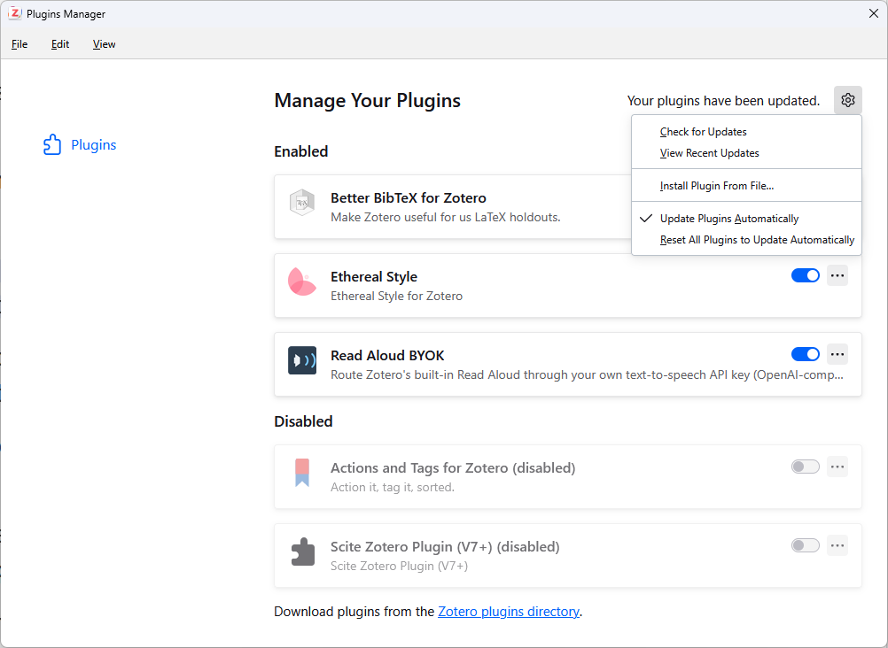

#  Read Aloud BYOK

[](https://www.zotero.org)
[](https://github.com/GeneralPawz/zotero-tts-byok/releases/latest)
[](https://github.com/GeneralPawz/zotero-tts-byok/releases)
[](https://github.com/GeneralPawz/zotero-tts-byok/actions/workflows/ci.yml)
[](LICENSE)
[](https://github.com/sponsors/GeneralPawz)

Bring your own text-to-speech key to Zotero 9's built-in Read Aloud, instead of spending Zotero's
metered Standard/Premium minutes or falling back to the local SAPI voices.

Works with OpenAI-compatible endpoints (including OpenRouter and self-hosted servers), ElevenLabs,
Speechify, Azure Speech, Google Gemini TTS, or any custom endpoint. Adds a **Skip** panel to the
reader for leaving out titles, running heads, footnotes, tables, formulas, citations, URLs and
bracketed asides — and stitches sentences broken across a page break back together.


## Install 🚀

**[Download the latest release](https://github.com/GeneralPawz/zotero-tts-byok/releases/latest/download/read-aloud-byok.xpi)**
— or pick a specific build from the [releases page](https://github.com/GeneralPawz/zotero-tts-byok/releases).

In Zotero: **Tools → Plugins**, then the gear icon → **Install Plugin From File…** and choose the
`.xpi`. Open **Edit → Settings → Read Aloud BYOK** to configure it; the **About** section at the
foot of the pane shows which build is actually running.



> [!TIP]
> If a PDF tab is already open, close and reopen it — the voice list is fetched when the reader
> initialises.

### Updates 🔄

Zotero updates the plugin itself, so this is a one-time install. It polls the update manifest in
this repository and offers whatever version that advertises. **Check for Updates** in the same
gear menu forces a check, and **Update Plugins Automatically** leaves it to Zotero.

To build from a checkout instead:

```powershell
.\build.ps1
```

## Requirements 📋

> [!IMPORTANT]
> You must be signed in to a Zotero account. The reader only asks for remote voices at all when
> `Zotero.Sync.Runner.enabled` is true, and that check happens before this plugin is consulted.
> **No Zotero credits are consumed by your own voices** — the requirement is the sign-in, not the
> subscription.

Everything else — the provider, the key, the model — is yours to choose.

## Documentation 📖

| Page | What is in it |
| --- | --- |
| [Providers](docs/providers.md) | OpenAI-compatible endpoints, OpenRouter, ElevenLabs, Speechify, Azure, Gemini and custom endpoints; choosing a model; describing your voices |
| [Speaking style](docs/speaking-style.md) | Style prompts, the tested inline emotion tags, and giving each character its own voice |
| [Skip rules](docs/skip.md) | Leaving out titles, running heads, footnotes, tables, formulas, citations, URLs and bracketed asides |
| [Testing and diagnostics](docs/diagnostics.md) | The test bar, the JSONL log, and every setting the pane exposes |
| [Development](docs/development.md) | How the integration works, repository layout, localisation, tests, releasing, and how the screenshots are made |

## Hearing what it does 🎧

**[Download the speaking test](https://github.com/GeneralPawz/zotero-tts-byok/releases/latest/download/speaking-test.pdf)**
— a two-page scene written to exercise the plugin. Add it to Zotero and read it aloud.

It uses every one of the eighteen tested emotion tags at least once, and its dialogue is tagged
for two characters, so configuring speakers named `Mara` and `Theo` plus a voice for untagged text
gives you a narrator and a cast rather than one voice reading everything. See
[Speaking style](docs/speaking-style.md) for how the tags work.

## How it works, briefly 🔍

Zotero's reader gets its voice catalog and its audio from the parent process through two methods
on `Zotero.Sync.APIClient.prototype`. This plugin wraps both: voices you configure are merged into
the catalog under a namespaced `byok:` ID, and any audio request for one of those IDs is answered
by your provider rather than `api.zotero.org`.

Everything else stays stock Zotero — sentence segmentation, the three-segment prefetch, the
parent-process audio cache, playback speed, sentence highlighting, annotation from the reading
position, and resume-where-you-left-off. Because `creditsPerMinute` is reported as `0`, the reader
shows no quota bar and never offers to sell you more minutes for these voices.

[The long version is in the development notes.](docs/development.md)

## Funding 💸

Read Aloud BYOK is free and always will be — it spends your API key, not mine, and takes no cut of
anything. If it saves you the price of a few hours of narration and you'd like to send something
back, [sponsorship is welcome](https://github.com/sponsors/GeneralPawz), and entirely optional.

Bug reports and pull requests are worth just as much.
