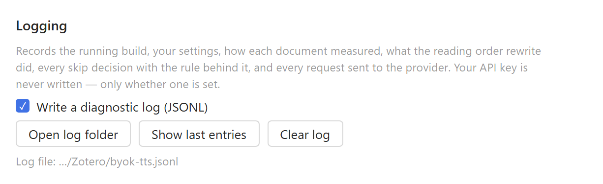

# Testing and diagnostics

The test bar, the diagnostic log, and every setting the pane exposes.

[← Read Aloud BYOK](../README.md)

## The test bar

A bar pinned to the top of the settings pane carries **Speak a test phrase**, which plays the
first configured voice with whatever is currently set — so a style prompt or an emotion tag can be
tried repeatedly without leaving the section being edited. It turns green after a success and red
after a failure, with the gist of the result beside it. **Output ⤓** jumps to Maintenance, where
the full message and the copy button live; nothing drags you there on its own.

Right-click either test button to choose which voice and language to test with, or to set a phrase
of your own in place of the built-in sample — useful for hearing one emotion tag in isolation.

## Diagnostic log

**Write a diagnostic log (JSONL)** in the preferences pane appends one JSON object per line to
`byok-tts.jsonl` in the Zotero profile. Off by default. It records:

| Event | Contents |
| --- | --- |
| `session` | plugin build, Zotero version, every effective setting |
| `prepare` | whether the reading order could be rewritten, and the segment counts |
| `analyze` | measured body height, margin band, front-matter boundary, repeated lines found |
| `rewrite` | how many segments were dropped and stitched, and whether it took effect |
| `segment` | every skip/speak decision with the rule, page, height, position and text |
| `request` | provider, model, voice, characters sent, duration, bytes or error |

The API key is never written — only `apiKeySet: true/false`. **Show log file** reveals it, **Show
last entries** prints the tail into the copyable status box, **Clear log** starts fresh.

The pane header shows the running plugin and Zotero versions, so it is always possible to confirm
which build is actually loaded.

## Settings

- **Show voices under** — which tier tab holds your voices. Premium by default.
- **Send text in chunks of** — sentences start playing sooner and highlight precisely; paragraphs
  sound more natural across clause boundaries and cost fewer requests, but buffer longer.
- **Hide Zotero's own Standard and Premium voices** — keeps you from accidentally spending
  remaining Zotero credits. Local system voices are unaffected.
- **Clear cached audio** — drops Zotero's `read-aloud` cache. Cache keys include the voice ID, so
  this is only needed after changing a provider while keeping the same voice IDs.
- **Show last reader error** — the reader itself can only say "An unknown error occurred", so the
  full provider response from the last failed playback is kept and shown here.

Messages appear in a selectable box with a **Copy message** button; provider errors are quoted in
full up to 2000 characters.

## Notes

- Audio must be in a format `AudioContext.decodeAudioData()` accepts: mp3, wav, flac, aac, or Opus
  in an Ogg container. Raw PCM only works through the PCM sample-rate option.
- Playback speed is applied by the reader, so the plugin always requests 1× from the provider.
- Failed requests are not retried, so a bad key or a down server surfaces immediately in the
  reader rather than stalling. Details go to Help → Debug Output Logging.
- Your API key is stored in plain text in the profile's `prefs.js`, like other Zotero plugin
  settings.
- Text of the passages you play is sent to whichever provider you configure.
