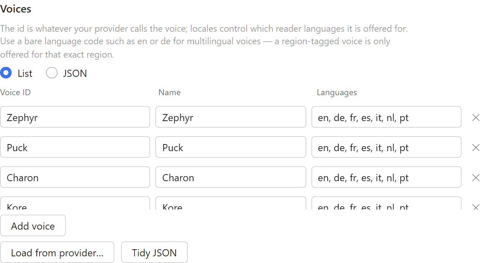

# Providers

Setting up each supported text-to-speech service, choosing a model, and describing your voices.

[← Read Aloud BYOK](../README.md)

## Provider setup

### OpenAI-compatible

Works with OpenAI, Groq, DeepInfra, Lemonfox, and self-hosted servers that implement
`POST /v1/audio/speech` — Kokoro-FastAPI, Speaches, openedai-speech, LM Studio.

| Field | Example |
| --- | --- |
| Base URL | `https://api.openai.com/v1` or `http://127.0.0.1:8880/v1` |
| Model | `gpt-4o-mini-tts`, `tts-1`, `kokoro` |
| Audio format | `mp3` |

For local servers, **Load from provider…** reads `GET /audio/voices`. `api.openai.com` has no such
endpoint, so its voices are pre-filled instead.

### OpenRouter

Its own entry in the provider list, though it speaks the OpenAI dialect — one key across every
TTS provider it routes to.

| Field | Value |
| --- | --- |
| Provider | OpenRouter |
| Base URL | `https://openrouter.ai/api/v1` |
| Model | a speech slug, e.g. `google/gemini-3.1-flash-tts-preview` |
| Audio format | `mp3`, or `pcm` for models that refuse everything else |

OpenRouter reports *that* a model accepts `response_format` but not which values, so a mismatch
only shows up as `HTTP 400`. Gemini TTS in particular accepts **`pcm` only** — select that and the
plugin adds a WAV header at the configured sample rate (24000 for Gemini and OpenAI).

OpenRouter's speech models are **not** in its default `/models` listing, and there is no OpenAI TTS
model on it at all — `openai/gpt-4o-mini-tts` and the voices `alloy`/`nova` do not exist there.
**Load from provider…** queries `/models?output_modalities=speech`, matches your configured model,
and fills in its `supported_voices`; if the slug is wrong it lists every valid one.

Some slugs, cheapest first: `google/gemini-3.1-flash-tts-preview` (30 multilingual voices),
`hexgrad/kokoro-82m` (54 voices, no German), `microsoft/mai-voice-2-flash`,
`mistralai/voxtral-mini-tts-2603`, `deepgram/aura-2` (90 voices incl. 7 German), `x-ai/grok-voice-tts-1.0`.

### ElevenLabs

| Field | Example |
| --- | --- |
| Base URL | `https://api.elevenlabs.io/v1` |
| Model | `eleven_turbo_v2_5` (fast/cheap) or `eleven_multilingual_v2` (best quality) |

**Load from provider…** pulls your voice library, including cloned voices. Voice IDs are the
ElevenLabs `voice_id` values.

### Speechify

| Field | Example |
| --- | --- |
| Base URL | `https://api.speechify.ai/v1` |
| API key | from `platform.speechify.ai/api-keys`, sent as `Authorization: Bearer` |
| Model | `simba-3.0` (default), `simba-3.2`, `simba-english`, `simba-multilingual` |

Uses `POST /audio/speech`, which returns base64 audio in `audio_data`; the plugin requests mp3 and
decodes it. The voice's locale is passed as `language` so multilingual models pick the right accent.

**Load from provider…** reads `GET /voices`, following `next_cursor` pagination, and derives each
voice's languages from the locales its models declare.

### Azure Speech

| Field | Example |
| --- | --- |
| Region or endpoint URL | `westeurope`, or a full custom endpoint URL |
| API key | Your Speech resource key |
| Voice IDs | `de-DE-KatjaNeural`, `en-US-AvaNeural` |

Requests are sent as SSML; the voice ID is the Azure short name. Enter voices manually.

### Google Gemini TTS

| Field | Example |
| --- | --- |
| Base URL | `https://generativelanguage.googleapis.com/v1beta` |
| Model | `gemini-2.5-flash-preview-tts` |
| Voice IDs | `Kore`, `Puck`, `Charon`, `Zephyr` |

Gemini returns headerless 24 kHz mono PCM, which the plugin wraps in a WAV container before
handing it to the reader.

### Custom endpoint

For anything else. Placeholders `{{text}}`, `{{voice}}`, `{{model}}`, `{{lang}}` and `{{key}}` are
substituted into the URL, headers and body. Values going into the JSON body are string-escaped, so
quotes and newlines in the source text can't break the request.

If the endpoint returns raw audio bytes, leave **Audio path** empty. If it returns base64 inside
JSON, give the dotted path to it, plus a MIME type — or a **Raw PCM sample rate** if the payload
has no container.

## Choosing a model

The Model field is a combobox: type an id, or pick one from the list. It starts with the models
known to work for the selected provider, and **Load models…** replaces that with whatever the
provider actually offers:

| Provider | Endpoint |
| --- | --- |
| OpenRouter | `GET /models?output_modalities=speech` — speech models only, since they are absent from the default listing |
| OpenAI-compatible | `GET /models`, narrowed to speech-capable ids; a local server usually lists only what it serves, so an empty filter falls back to everything |
| Speechify | `GET /audio/models`, deprecated ones dropped |
| ElevenLabs | `GET /models` |
| Gemini | `GET /models`, narrowed to TTS |

Azure has no model concept — its voice id carries everything — so the field and the button are
hidden there.

## Voice list format

The Voices section has two views. **List** is a plain editor — one row per voice, with an add and
a remove button — and is the one to use if JSON is not your thing. **JSON** is the same data raw,
with syntax highlighting, for pasting a whole set at once. Both write the same setting, so you can
switch between them freely.



```json
[
  { "id": "nova", "label": "Nova", "locales": ["en", "de"] },
  { "id": "de-DE-KatjaNeural", "label": "Katja", "locales": ["de-DE"] }
]
```

`locales` decides which reader languages offer the voice. The reader picks a language from the
document, so a voice needs a matching locale listed to show up.

Use a **bare language code** (`en`, `de`) for multilingual voices: the reader offers a
region-tagged voice only for documents in that exact region, but an untagged one for every region,
so `en-US` would hide the voice from an `en-GB` document. Tag the region only when the voice really
is region-specific, as Azure's neural voices are.
