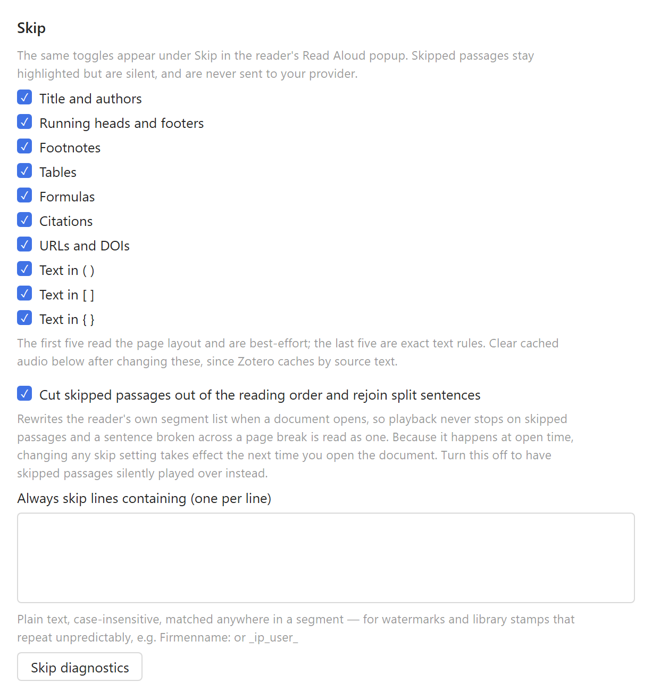

# Skip rules

Leaving out titles, running heads, footnotes, tables, formulas, citations, URLs and bracketed asides.

[← Read Aloud BYOK](../README.md)

A **Skip** row is added to the reader's Read Aloud popup; clicking it reveals toggles for what to
leave out. The same toggles are mirrored in this plugin's preferences pane.

Skipped passages are never sent to the provider, so they cost nothing. How they are removed depends
on one setting:

- **Cut skipped passages out of the reading order** (default): when a document opens, the reader's
  own segment list is measured, pruned, and sentences split across a page break are stitched back
  together. Playback then never reaches the skipped passages at all — no pause at page boundaries,
  and a broken sentence is spoken as one. Because this happens at open time, changing a skip
  setting takes effect the next time the document is opened.
- With it off, skipped segments stay in the list and are answered locally with a beat of silence.
  Changes take effect immediately, but playback visibly steps over each skipped passage.

Anything the rewrite misses still falls back to the silence path, so the two work together.

Two kinds of rule:

**Exact text rules** rewrite the sentence before it is spoken.

| Rule | Removes |
| --- | --- |
| Text in ( ) [ ] { } | Balanced pairs including nested ones, so `(see Fig. 2 (right))` goes entirely |
| Citations | `[12]`, `[3, 4]`, `(Smith et al., 2020)`, `(Doe & Roe 1999; Lee 2001)`, trailing markers |
| URLs and DOIs | `http(s)://…`, `www.…`, `doi:…`, bare `10.xxxx/…`, e-mail addresses |

**Layout rules** drop a whole segment, and are best-effort. Zotero gives each segment a page index
and its rectangles, so rect height stands in for font size:

| Rule | How it decides |
| --- | --- |
| Title and authors | Page one up to the first run of 100+ characters, capped at 20 segments |
| Running heads and footers | Lines up to 200 chars whose text, with digits normalised, repeats on 2+ pages |
| Footnotes | Type noticeably smaller than the document's median |
| Formulas | Dense in operators, and too few real words to be a sentence |
| Tables | Mostly numeric cells, or rectangles separated by wide column gaps |

The layout rules need the document measured first, which reads the reader's internal segment list.
Measuring happens when the reader panel opens and, failing that, before the first segment is
spoken. If it fails the rules simply stay inactive — press **Skip diagnostics** in the preferences
pane to see whether a document was measured and exactly which repeated lines were found.

Citation stripping is heuristic where trailing superscript markers are concerned: `…as shown.12`
loses the marker, but so would `sample1` if it appeared in running text.

**Always skip lines containing** is the escape hatch for anything the heuristics miss — library
watermarks and print stamps in particular, whose text extraction can differ from page to page so
that the repeated-line rule never sees two identical copies. One plain, case-insensitive string per
line, matched anywhere in a segment.
