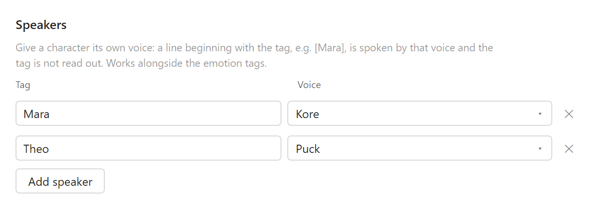

# Speaking style

Directing how the text is delivered: style prompts, inline emotion tags, and a voice per character.

[← Read Aloud BYOK](../README.md)


Expressive models take direction in natural language. Gemini's convention is to put it in the text
itself — `Say cheerfully: Have a wonderful day!` — and it also honours inline tags like
`[whispers]`, `[shouting]`, `[excited]` and `[sigh]`. OpenAI's expressive models instead read an
`instructions` field. The **Send it** dropdown picks which of the two the plugin uses.

In prepend mode the prompt is glued to the front of every segment, joined by a space if it ends in
a colon or dash and by a blank line otherwise, so both of these work:

```
Say the following calmly and clearly, at a measured pace:
```
```
You are reading an academic paper aloud to a colleague. Keep the tone even and unhurried.
```

Two things to know. Zotero's audio cache is keyed on the voice and the *source* text, not the style
prompt, so **Clear cached audio** after changing it or you'll keep hearing the previous delivery.
And direction lands more reliably on paragraphs than on single sentences — if a model starts
reading the instruction aloud, switch the chunk size to paragraphs.

**Extra request JSON** is merged over the request body for provider-specific controls, such as
`{"provider":{"options":{"style":"cheerful","styledegree":1.5}}}` for Azure MAI-Voice-2 via
OpenRouter.

### Inline emotion tags

Gemini reads bracketed tags as performance direction rather than speaking them. They work in the
style prompt and equally inside a document's own text. The **Insert emotion tag** picker under the
prompt offers the tested set, grouped as below, and drops the choice in at the cursor.

These have been tested and work; they are ordinary English words, so spelling matters more than
the brackets do.

| Register | Tags |
| --- | --- |
| Amusement | `[laughing]`, `[silly]`, `[hysterical]` |
| Joy | `[joyful]`, `[delighted]`, `[thrilled]`, `[ecstatic]` |
| Yearning | `[longing]`, `[lust]` |
| Surprise | `[surprised]`, `[startled]`, `[flabbergasted]` |
| Displeasure | `[annoyed]`, `[bitter]`, `[angry]`, `[hostile]`, `[disgusted]` |
| Delivery | `[whispering]` |

### Speakers

A line beginning with a configured speaker tag is spoken by that character's voice, and the tag
itself is not read out:

```
[Mara] [angry] “THEO?!”
[Theo] [silly] “Would you believe I’m a highly trained pastry inspector?”
```



> [!NOTE]
> **[Watch it working](../images/multi-speaker.mp4)** — half a minute of the speaking test being
> read by a narrator and two characters. The recording has sound, which is rather the point.
> GitHub opens `.mp4` files in a player; the file is also in the repository under `images/`.

#### Setting it up

Three things have to line up, and the second is the one people miss:

1. **The voices exist.** Each speaker points at a voice **id** from your Voices list, so add the
   voices first. A speaker naming a voice that is not configured is ignored rather than guessed at.
2. **The tag starts the line.** `matchSpeaker` looks at the beginning of a segment only — a tag in
   the middle of a sentence is left alone and read out as text.
3. **A voice for untagged text**, if you want a narrator. Left unset, narration simply keeps
   whichever voice is selected in the reader, which is also a perfectly good arrangement.

A worked example, matching the speaking test:

| Setting | Value |
| --- | --- |
| Voices | `Zephyr`, `Puck`, `Charon` (or any three from your provider) |
| Speaker `Mara` | `Kore` |
| Speaker `Theo` | `Puck` |
| Voice for untagged text | `Charon` |

```
[Mara] [angry] “Theo!” She lowered the rolling pin by perhaps two inches.
```

read as sentence chunks becomes two requests: `“Theo!”` in Mara's voice with the tags stripped,
then `She lowered the rolling pin…` in the narrator's. Switch to paragraph chunks and the whole
passage goes to Mara instead, because the speaker tag is decided per segment — sentences are what
give you the alternation.

#### What it does not do

Automatic speaker detection is not attempted. Attribution in prose is genuinely ambiguous —
consecutive lines by one character, unattributed replies, dialogue split by a beat of narration —
and guessing wrong is worse than not guessing, so the tags are explicit.

Tags also have to be in the document. There is no way to tag a PDF you did not write, so this is
for material you control: notes, drafts, translations, anything exported to PDF yourself.

### Trying it

There is a document for trying all of this:
**[speaking-test.pdf](https://github.com/GeneralPawz/zotero-tts-byok/releases/latest/download/speaking-test.pdf)**,
attached to every release. Add it to Zotero and read it aloud to hear a voice handle the whole set
in context, rather than one tag at a time in the prompt box.

It is a two-page scene using every tag above at least once, with its dialogue tagged for two
characters — configure speakers named `Mara` and `Theo`, plus a voice for untagged text, and you
get a narrator and a cast. From a checkout, `node scripts/make-speaking-test.mjs` rebuilds it from
`test/fixtures/speaking-test.txt`.

Note that the tags are bracketed, and the **Text in [ ]** skip rule would otherwise strip them
before synthesis — which is why recognised emotion and speaker tags are held back from that rule.
An unrecognised bracket is still dropped as before.

Tags apply from where they appear until the mood shifts, so they can be mixed inside one passage:

```
[whispering] The manuscript had been missing for eighty years. [thrilled] And there it was.
```

They combine with the style prompt — the prompt sets the baseline register for everything, the
tags move it locally. Since Zotero caches audio by voice and source text, tags placed in a
document's own text are cached like any other reading; a changed **style prompt** is not, so clear
the cached audio after editing it.
